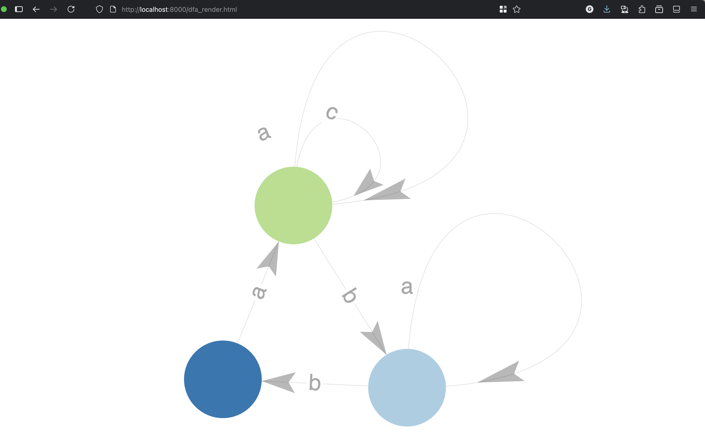
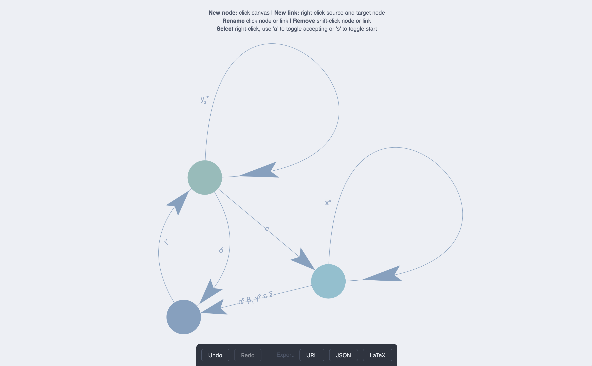

# FA Grader

Prototype of a tool for 1010 students to use for creating and testing their FA.

Currently there is only support for DFAs.

## Rendering a Python Object DFA

1. Run `python dfa.py` to create a DFA object as an example in the main function
2. Run a local server using `python -m http.server` in the terminal in this directory
3. Open your browser and go to `http://localhost:8000/dfa_render.html`

This should be using the dfa.json file in the directory created by `dfa.py`.
You can edit the JSON file to get a different result or create your own DFA object in python and save it as a JSON file

## Creating a DFA and Converting it to a Python Object

1. Run a local server using `python -m http.server` in the terminal in this directory
2. Open your browser and go to `http://localhost:8000/dfa_create.html`
3. Create your DFA using the instructions on the top of the page
4. Click the "Export DFA as JSON" button to download the DFA as a JSON file
5. Run `python dfa.py` and modify the main function to load your JSON file instead of dfa.json

## TODO

- Add everything (e.g. group names) in `dfa_render.html` to `dfa_create.html` s.t. `create` \supset `render`

- Make `dfa_create.html` use standard notation

- Add LaTeX support to renders (e.g Greek symbols)

- Add a test file which would do the autograding

- Add a FA library to hold the reused rendering functions

- Export to LaTeX Tikz Diagrams (?)

## License

This uses a [force graph library](https://vasturiano.github.io/force-graph/)
