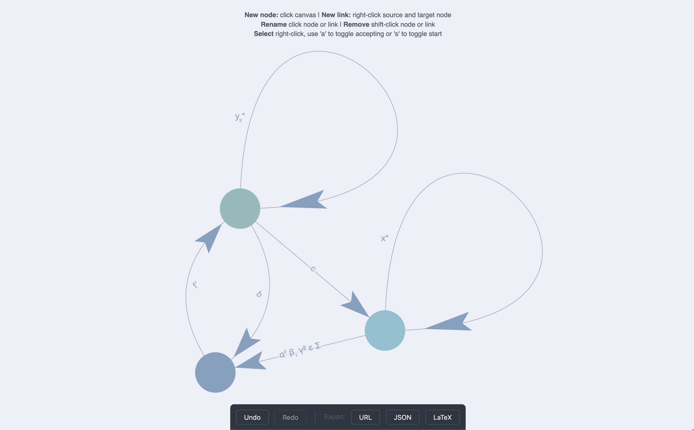
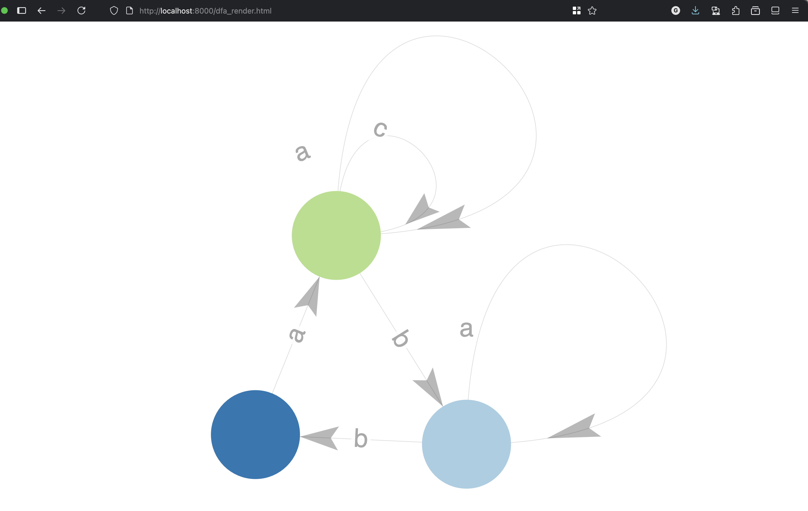

# Finite Automaton Autograder

Prototype of a tool for 1010 students to use for creating and testing their FA.

Repo: [https://github.com/Geoc2022/finite-automaton-autograder](https://github.com/Geoc2022/finite-automaton-autograder)

## Creating a FA and Converting it to LaTeX, shareable link, or Python Object

### Online: [https://george.chemmala.com/finite-automaton-autograder/fa_create](https://george.chemmala.com/finite-automaton-autograder/fa_create)

### Locally:

1. Run a local server using `python -m http.server` in the terminal in this directory
2. Open your browser and go to `http://localhost:8000/fa_create.html`
3. Create your FA using the instructions on the top of the page
4. Click the "Export: JSON" button to download the FA as a JSON file
5. Run `python dfa.py` and modify the main function to load your JSON file instead of dfa.json

[](https://youtu.be/buHxhtm65_8)

## How to use this with Gradescope

This project is designed to be easily integrated with Gradescope for autograding assignments. The `example_assignments` directory provides a template for setting up homework assignments.

```text
example_assignments
├── hw1
│   ├── autograder
│   │   ├── autograder.zip
│   │   ├── student_files.txt
│   │   └── tests
│   └── sol
│       ├── handout.md
│       ├── sol1.json
│       ├── sol2a.json
│       └── sol2b.json
└── zipAutograder
    ├── dfa.py
    ├── generate.py
    ├── grader.py
    ├── requirements.txt
    ├── run_tests.py
    └── setup.sh
```

### Setup and Generation

1. `zipAutograder/`: Contains the core logic and scripts required for the Gradescope environment, including `dfa.py`, `grader.py`, and `setup.sh` (for installing dependencies).
2. `hw*/sol/`: Contains the problem handout and reference solutions.
3. `hw*/autograder/`: Contains the test suite (`tests/`) and `student_files.txt` which lists the files students are expected to submit.

To generate a Gradescope-compatible `autograder.zip` for a specific homework (e.g., Homework 1), run the following command from the `example_assignments` directory:

```bash
python zipAutograder/generate.py -hw 1
```

This script bundles the generic autograder files with the homework-specific tests and solution metadata into `example_assignments/hw1/autograder/autograder.zip`, which can be uploaded directly to Gradescope.


## Running and Testing a DFA

Check out the example in `grader.py` bellow:

```python
# Constructing a DFA that accepts binary strings that are multiples of 3
dfa = DFA(
    states={'q0', 'q1', 'q2'},
    alphabet={'1', '0'},
    transitions={
        'q0': {'0': 'q0', '1': 'q1'},
        'q1': {'0': 'q2', '1': 'q0'},
        'q2': {'0': 'q1', '1': 'q2'}
    },
    start_state='q0',
    accept_states={'q0'}
)

wrong_dfa = DFA(
    states={'q0', 'q1', 'q2'},
    alphabet={'1', '0'},
    transitions={
        'q0': {'0': 'q0', '1': 'q1'},
        'q1': {'0': 'q2', '1': 'q0'},
        'q2': {'0': 'q1', '1': 'q3'}
    },
    start_state='q0',
    accept_states={'q0', 'q2'} # Incorrectly accepts q2
)

autograder = Grader()

autograder.add_test(
        lambda x: (bin(x * 3)[2:], True), 10
)
autograder.add_test(
        lambda x: (bin(x * 3 + 1)[2:], False), 10
)

autograder.add_test(
        lambda x: (bin(x)[2:], x % 3 == 0), 10
)

def random_test(_: int):
    n = random.randint(0, 1000)
    return (bin(n)[2:], n % 3 == 0)
autograder.add_test(
        random_test, 2
)

print("Testing correct DFA:")
autograder.run(dfa)

print("\nTesting incorrect DFA:")
autograder.run(wrong_dfa)
```

Which outputs:

```
Testing correct DFA:
Test 1: Passed
Test 2: Passed
Test 3: Passed
Test 4: Passed

Testing incorrect DFA:
Test 1: Failed
Test 2: Passed
Test 3: Failed
Test 4: Passed
```


## Rendering a Python Object DFA

1. Run `python dfa.py` to create a DFA object as an example in the main function
2. Run a local server using `python -m http.server` in the terminal in this directory
3. Open your browser and go to `http://localhost:8000/dfa_render.html`

This should be using the dfa.json file in the directory created by `dfa.py`.
You can edit the JSON file to get a different result or create your own DFA object in python and save it as a JSON file




## TODO

- Add a test file which would do the autograding

- Add a FA library to hold the reused rendering functions

## License

This uses a [force graph library](https://vasturiano.github.io/force-graph/)
